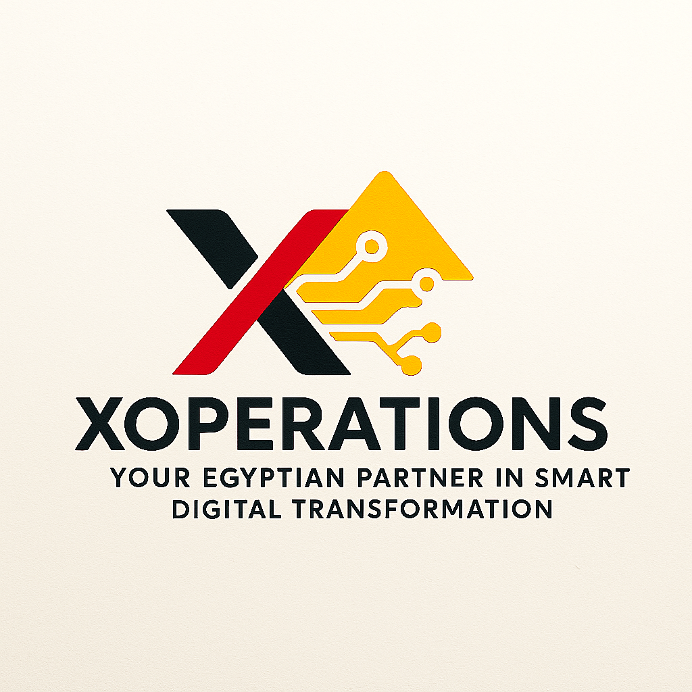

*Xoperations*

  

*Project Overview*:
In a rapidly evolving Egyptian market, XOperations is a specialized software company offering intelligent and customized software/networking/cybersecurity solutions. We help businesses with digital transformation, improving efficiency, and boosting productivity through integrated technology services.

# XOperations – Your Egyptian Partner for Smart Digital Transformation!

*Technologies Used*:
- ReactJS – For building the user interface.
- Bootstrap – For responsive and modern styling "UI Framework".
- Axios – For handling API requests.
- FontAwesome – For icons and UI enhancements.
- Figma – For UI/UX design and prototyping.

*License*
No one can use any part of this software unless he didn't pay anything for it.